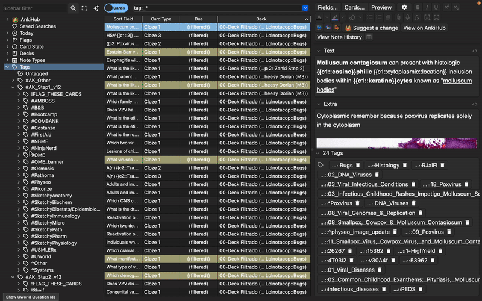

  

# 📘 Anki⭢UWorldID  
### UWorld Question ID Extractor for Anki (Qt6 Only — Supports AnKing v11 & v12)

**Anki⭢UWorldID** is a modern Anki add-on that extracts **UWorld Question IDs** from card tags — fully compatible with both **AnKing Overhaul v11** and **AnKing Overhaul v12** tagging formats.

If your deck contains UWorld-tagged material from either version, this add-on will detect, parse, and categorize all question IDs automatically.

---

# 🚀 Fully Compatible with AnKing v11 AND v12

This add-on was specifically built to support **both generations** of UWorld tagging:

### 🔹 **AnKing v12 format**
- `#AK_Step1_v12::#UWorld::Step::12345`
- `#AK_Step2_v12::#UWorld::Step2::12345`
- `#AK_Step3_v12::#UWorld::Step::12345`

### 🔹 **AnKing v11 format**
- `#AK_Step1_v11::#UWorld::12345`
- `#AK_Step2_v11::#UWorld::12345`
- `#AK_Step3_v11::#UWorld::12345`

Both formats are recognized **simultaneously**, allowing mixed-version decks or migration workflows.

---

# ⚠️ Qt6 Required

This add-on works **only** on Anki versions that ship with **Qt6**, including:

- **Anki 2.1.55+**
- **Anki 23.x**
- **Anki 24.x**
- **Anki 25.x**

🚫 **Not compatible with Qt5-based Anki (pre-2023)**.

---

# 📥 Installation (Recommended)

Install directly via AnkiWeb:

👉 **AnkiWeb: https://ankiweb.net/shared/info/XXXXXXXX**  
*(replace with your add-on ID once published)*

After installation, restart Anki.

---

# ✨ Features

### ✔ Extract IDs from the current deck  
Tools → **Extract UWorld IDs (current deck)**  
Great for global deck checks.

### ✔ Extract IDs from Browser (selection-aware)  
In the Browser:

- If cards are **selected**, extraction runs only on the selection.  
- If **none selected**, extraction runs on **all cards visible in the search**.

Access via:
- **Edit → Extract UWorld IDs**
- **Right-click → Extract UWorld IDs**

### ✔ Sidebar Quick Button  
Added beside the Browser filter box:

**“Show UWorld Question IDs”**

This extracts IDs from **all currently visible cards**, ignoring selection.

### ✔ Clean UI (with automatic grouping and preview)
Results are grouped into:

- **Step 1**
- **Step 2**
- **Step 3**

Each showing:
- Total question count  
- Preview of first 10 IDs  
- **Copy IDs** button  

### ✔ Robust detection for AnKing v11 & v12  
The add-on scans every tag using regex patterns for both versions, allowing hybrid decks, migrated cards, or custom user tagging.

---

# 🔍 How It Works

1. All card tags are scanned for UWorld patterns (v11 + v12).  
2. IDs are extracted, deduplicated, normalized, and sorted.  
3. IDs are grouped by Step (1/2/3).  
4. The results are displayed in a transparent, easy-to-copy dialog.  

Everything is **read-only** — your cards and deck remain unchanged.

---

# 🖥 Demo (see GIF above)

You can observe:
- Deck-wide extraction  
- Extraction from Browser selections  
- Extraction from current search  
- Sidebar quick-access button  
- Per-step ID previews and clipboard export  

---

# 🤝 Contributing

Issues, feature requests, and PRs are welcome!

---

# 📝 License

Released under the **MIT License**.  
See `LICENSE` for details.

---

# ⭐ Support the Project

If Anki⭢UWorldID improved your workflow, consider:

- ⭐ Starring the GitHub repo  
- 💬 Leaving a review on AnkiWeb  

Your support helps this tool grow and reach more medical students.

